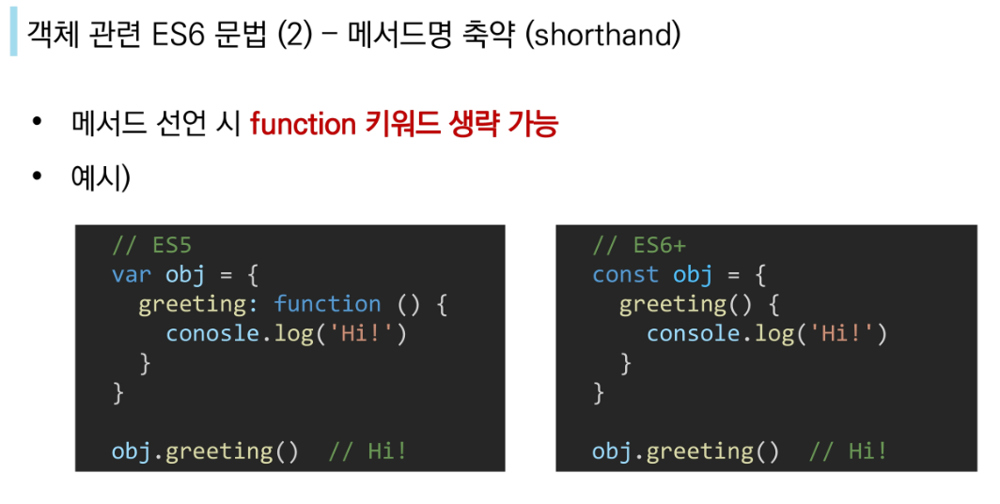

# 구조분해할당

---

배열의 원소나 객체의 프로퍼티를 추출해서 변수에 저장할 수 있도록 해줌

**1. array destructuring**

```javascript
[a, b] = ['Hello', 'Max']
console.log(a) // Hello
console.log(b) // Max
```

**2. object destructuring**

```javascript
{name} = {name:'Max', age:28}
console.log(name) // Max
console.log(age) // undefined
```

**배열의 구조분해할당 예시**

```javascript
const numbers = [1, 2, 3];
[num1, num2] = numbers; // num1은 1, num2는 2
[num1, , num2] = numbers; // num1은 1, num2는 3(num1과 num2 사이에 공백 , ,이 있기 때문에)
// 개인적으로 이게 많이 쓰일까?싶긴 함
```

**객체의 구조분해할당 예시**





