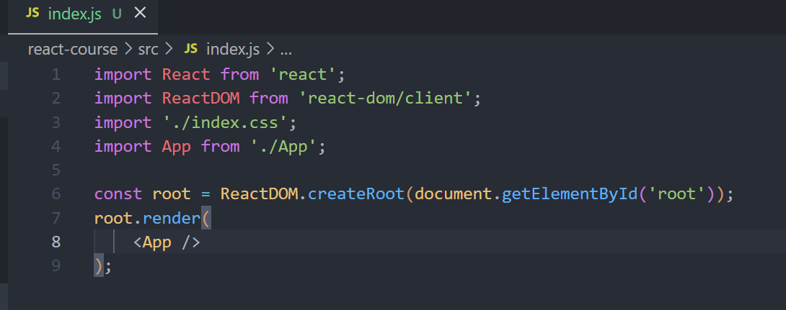
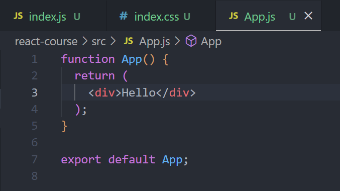

# React

---

## SPA 구축

SPA: single page applications

---

## 리액트 프로젝트 만들기

```bash
$ npx create-react-app my-app # react 프로젝트 생성하는 명령어
# Node.js 설치 필수

$ cd my-app # 생성한 프로젝트 폴더로 이동

$ npm start # 프로젝트의 스크립트 실행(개발 서버 실행)
```

npm start로 개발 서버를 열면? 리액트 개발한 곳에서 넣어둔 더미 웹사이트를 볼 수 있을 것.

이 더미 사이트를 지우고 새로이 코드를 짜 넣어보자

**쓸데없는 파일을 우선 지워보자** -> src 폴더의 경우 app.js, index.css, index.js 파일만 제외하고 모두 삭제했음(강의에서)

파일을 지웠으면? 어딘가에 import 되어있을 파일 몇 개의 이름을 지워줄 필요가 있겠지 (Vue와 마찬가지로, import 해뒀으면서 사용되지 않은 부분은 에러를 야기함)

**index.js**



위의 모양처럼 맞춰주자 (reportWebVitals 관련 import 및 코드 삭제, React.StrictMode 삭제)


**App.js**

src 폴더에서 logo와 App.css를 지웠기 때문에, 해당 파일에 import 되어있는 logo와 App.css 부분을 지워줄 필요가 있음

그 후 return 안에 있는 모든 html 코드를 다 지워주자



---

## Package.json

프로젝트가 참조중인 라이브러리들을 확인 가능함 (dependencies)

```bash
# Vue랑 똑같은 부분
$ npm install # dependency에 들어가있는 라이브러리들을 자동으로 설치한 후 node_modules에 저장
```

---

## React 작동 방식 및 컴포넌트 이해