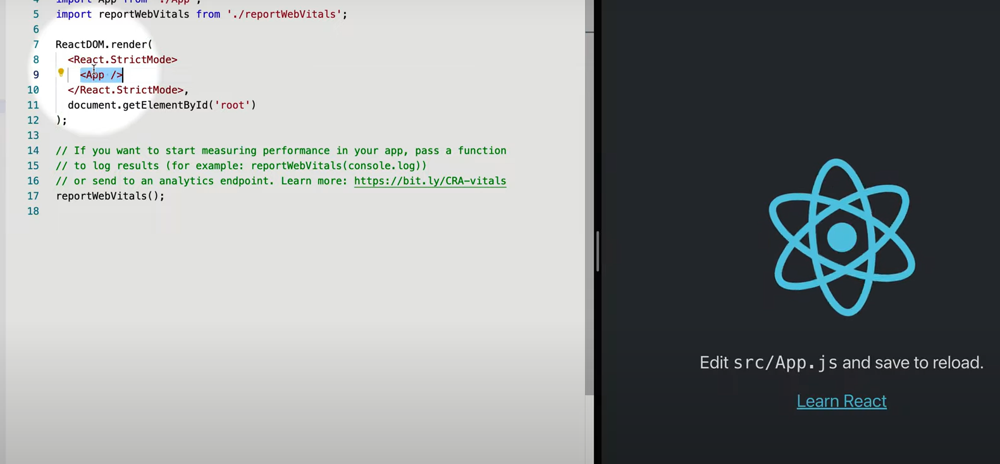
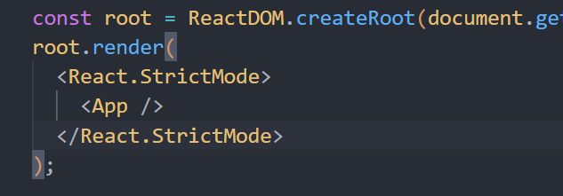
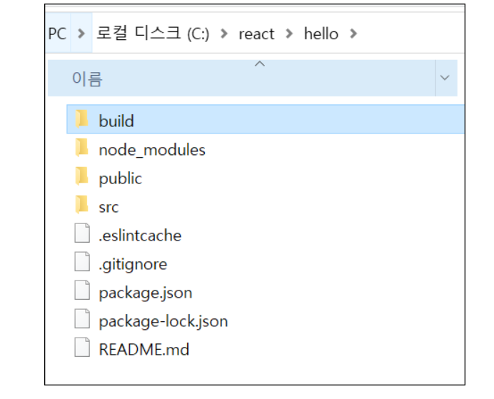
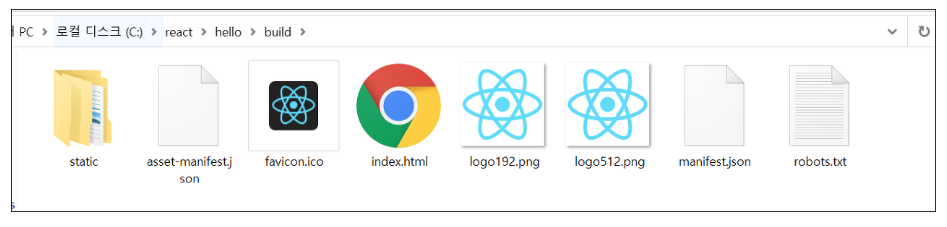
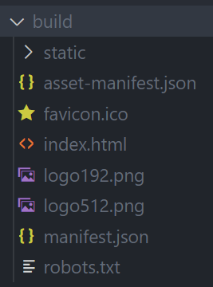
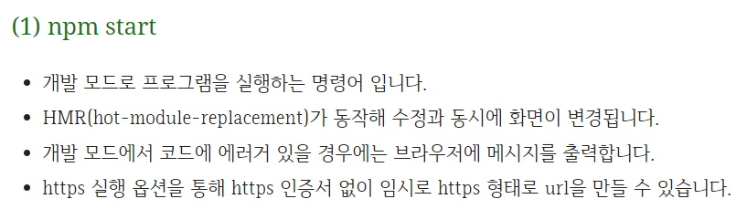
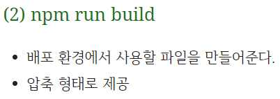
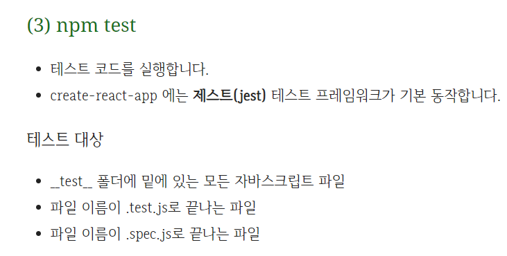
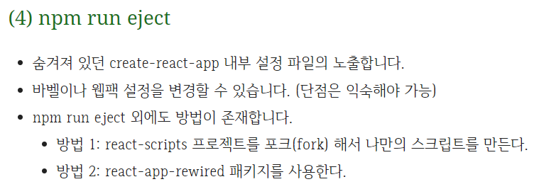
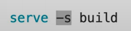

## React 시작

---

1. 프로젝트 생성(node.js 사전 설치 필수)

```bash
npx create-react-app my-app
```

2. src 폴더
   - index.js: npm start를 이용해 구동시키면 index.js 파일을 찾아 거기 적혀있는대로 동작
   - 
   - <APP /> 이라는 부분을 지우면 우측의 화면은 빈 화면으로 바뀌게 됨. APP라는 태그에 해당 화면의 정보가 담겨있었다고 보면 된다

---

## 수정

---

1. src 폴더의 index.js 파일을 보자
   - 입구 파일임. npm start를 이용하여 리액트를 구동시키면, index.js파일을 찾고 거기 적혀있는 대로 동작하게 됨
   - src/index.js 파일을 보면 App이라는 태그가 있음
   - 
   - 이 App이라는 태그를 지우면?
   - 

---

## 배포

---

1. npm start vs npm run build

- npm start의 경우 개발용 화면을 보여주는 역할
- npm run build의 경우 배포를 위한 빌드 생성 (실행시 build 폴더가 만들어짐. 이 폴더 안에는 사이트를 배포할 때 필요한 파일들만 모아져 있음)
- 
- 
- npm run build를 실행하면 다음과 같이 index.html 파일이 생성됨(위의 사진에도 있는것을 확인할 수 있음)
- 
- 
- 
- 
- 
- build 관련 썸띵
  - 
  - 위의 명령어 (npx serve -s build) 를 이용하면, 사용자가 어떤 경로로 들어온다 한들 모두 build 폴더의 index.html 문서를 보여주게 됨 (build 폴더에 있는 index.html 문서를 serve 하겠다. 포트번호 뜨는거 들어가면 나옴)

---

## React는 사용자 정의 태그를 만드는 기술이다

---

